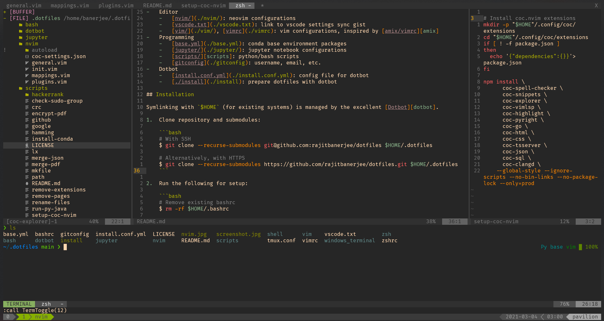

# Dotfiles \[[![Build Status][travis-badge]][travis]]

My custom configuration files:

- Shell
  - [zsh/](./zsh/), [zshrc](./zshrc): zsh configurations; plugins managed by [ohmyzsh][ohmyzsh]
  - [shell/](./shell/): common configs for all types of shells
  - [terminal/](./terminal/): terminal emulator settings
  - [tmux.conf](./tmux.conf): tmux configs, borrowed from [anishathalye/dotfiles/tmux.conf][anish]
  - [bash/](./bash/), [bashrc](./bashrc): bash configurations
- Editor
  - [nvim/](./nvim/): neovim configurations
  - [vscode.txt](./vscode.txt): link to vscode settings sync gist
  - [fonts/](./fonts/): preferred font files
- Programming
  - [base.yml](./base.yml): conda base environment packages
  - [jupyter/](./jupyter/): jupyter notebook configurations
  - [scripts/][scripts]: python/bash scripts
- Dotbot
  - [install.conf.yml](./install.conf.yml), [install-mac.conf.yml](./install-mac.conf.yml): config files for dotbot
  - [./install](./install), [./install-mac](./install-mac): prepare dotfiles with dotbot

## Installation

Symlinking with `$HOME` (for existing systems) is managed by the excellent [Dotbot][dotbot].

1.  Clone repository and submodules:

    ```zsh
    # With SSH
    $ git clone --recurse-submodules git@github.com:rajitbanerjee/dotfiles ~/.dotfiles

    # Alternatively, with HTTPS
    $ git clone --recurse-submodules https://github.com/rajitbanerjee/dotfiles.git ~/.dotfiles
    ```

2.  Run the following for setup:

    - macOS

      ```zsh
      # Symlink dotfiles
      $ cd ~/.dotfiles && ./install-mac
      ```

    - Linux/WSL2:

      ```bash
      # Remove existing bashrc
      $ rm -rf ~/.bashrc

      # Symlink dotfiles
      $ cd ~/.dotfiles && ./install
      ```


3.  Install a range of preferred packages. See [system-setup][ss], [system-setup-mac][ssm], [setup-coc-nvim][scn], [setup-vundle][sv].

    - macOS:

    ```zsh
    $ ./scripts/system-setup-mac

    # Set up Neovim and trigger vim-plug installations
    $ nvim
    $ npm cache verify
    $ ./scripts/setup-coc-nvim
    ```

    - Linux/WSL2:

    ```bash
    $ ./scripts/system-setup


    # Set up Neovim and trigger vim-plug installations (recommended)
    $ nvim
    $ npm cache verify
    $ ./scripts/setup-coc-nvim


    # Optionally, set up Vim and Vundle plugins
    $ ./scripts/setup-vundle
    ```

Neovim:



## License

[MIT][license]

[travis-badge]: https://api.travis-ci.com/rajitbanerjee/dotfiles.svg?branch=main
[travis]: https://travis-ci.com/rajitbanerjee/dotfiles
[scripts]: https://github.com/rajitbanerjee/scripts
[amix]: https://github.com/amix/vimrc
[anish]: https://github.com/anishathalye/dotfiles/blob/master/tmux.conf
[dotbot]: https://github.com/anishathalye/dotbot
[ohmyzsh]: https://github.com/ohmyzsh/ohmyzsh
[ss]: https://github.com/rajitbanerjee/scripts/blob/master/system-setup
[ssm]: https://github.com/rajitbanerjee/scripts/blob/master/system-setup-mac
[scn]: https://github.com/rajitbanerjee/scripts/blob/master/setup-coc-nvim
[sv]: https://github.com/rajitbanerjee/scripts/blob/master/setup-vundle
[license]: LICENSE
