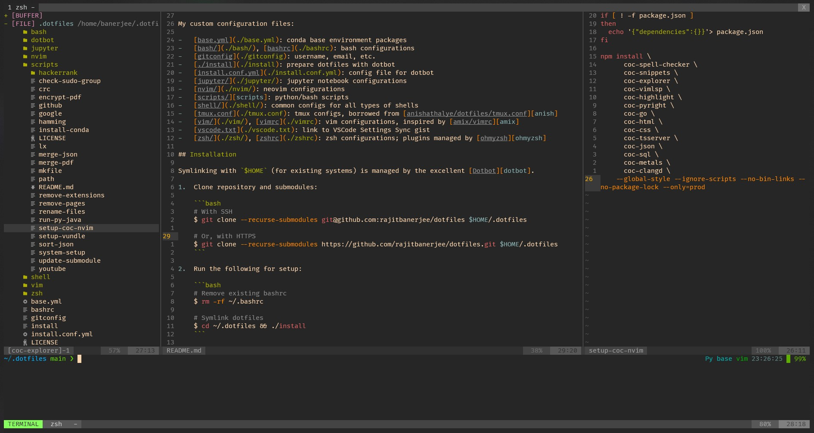

# Dotfiles \[[![Build Status][travis-badge]][travis]]

My custom configuration files:

-   [base.yml](./base.yml): conda base environment packages
-   [bash/](./bash/), [bashrc](./bashrc): bash configurations
-   [gitconfig](./gitconfig): username, email, etc.
-   [./install](./install): prepare dotfiles with dotbot
-   [install.conf.yml](./install.conf.yml): config file for dotbot
-   [jupyter/](./jupyter/): jupyter notebook configurations 
-   [nvim/](./nvim/): neovim configurations
-   [scripts/][scripts]: python/bash scripts
-   [shell/](./shell/): common configs for all types of shells
-   [tmux.conf](./tmux.conf): tmux configs, borrowed from [anishathalye/dotfiles/tmux.conf][anish]
-   [vim/](./vim/), [vimrc](./vimrc): vim configurations, inspired by [amix/vimrc][amix]
-   [vscode.txt](./vscode.txt): link to VSCode Settings Sync gist
-   [zsh/](./zsh/), [zshrc](./zshrc): zsh configurations; plugins managed by [ohmyzsh][ohmyzsh]

## Installation

Symlinking with `$HOME` (for existing systems) is managed by the excellent [Dotbot][dotbot].

1.  Clone repository and submodules:

    ```bash
    # With SSH
    $ git clone --recurse-submodules git@github.com:rajitbanerjee/dotfiles $HOME/.dotfiles

    # Alternatively, with HTTPS
    $ git clone --recurse-submodules https://github.com/rajitbanerjee/dotfiles.git $HOME/.dotfiles
    ```

2.  Run the following for setup:

    ```bash
    # Remove existing bashrc
    $ rm -rf $HOME/.bashrc

    # Symlink dotfiles
    $ cd $HOME/.dotfiles && ./install
    ```


3.  Install a range of preferred packages. See [system-setup][ss], [setup-coc-nvim][scn], [setup-vundle][sv].

    ```bash
    $ ./scripts/system-setup


    # Set up NeoVim and trigger vim-plug installations (recommended)
    $ nvim
    $ npm cache verify
    $ ./scripts/setup-coc-nvim


    # Optionally, set up Vim and Vundle plugins
    $ ./scripts/setup-vundle
    ```

NeoVim:



## License

[MIT][license]

[travis-badge]: https://api.travis-ci.com/rajitbanerjee/dotfiles.svg?branch=main

[travis]: https://travis-ci.com/rajitbanerjee/dotfiles

[scripts]: https://github.com/rajitbanerjee/scripts

[amix]: https://github.com/amix/vimrc

[anish]: https://github.com/anishathalye/dotfiles/blob/master/tmux.conf

[dotbot]: https://github.com/anishathalye/dotbot

[ohmyzsh]: https://github.com/ohmyzsh/ohmyzsh

[ss]: https://github.com/rajitbanerjee/scripts/blob/master/system-setup

[scn]: https://github.com/rajitbanerjee/scripts/blob/master/setup-coc-nvim

[sv]: https://github.com/rajitbanerjee/scripts/blob/master/setup-vundle

[license]: LICENSE
