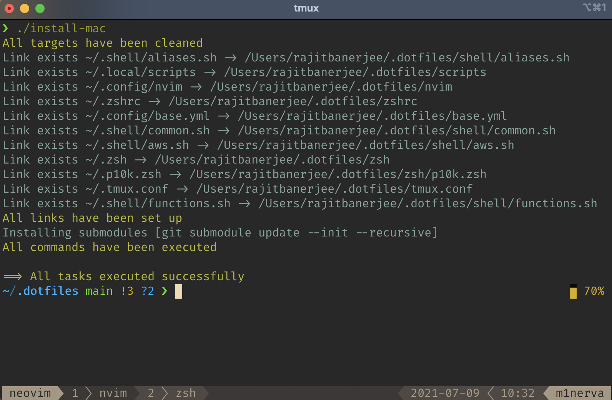
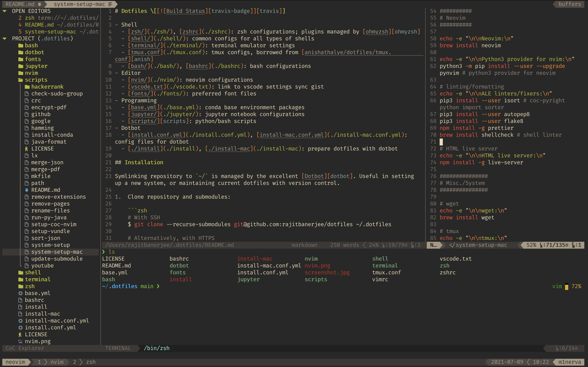

# Dotfiles \[[![Build Status][travis-badge]][travis]]

- Shell
  - [zsh/](./zsh/), [zshrc](./zshrc): zsh configurations; plugins managed by [ohmyzsh][ohmyzsh]
  - [shell/](./shell/): common configs for all types of shells
  - [terminal/](./terminal/): terminal emulator settings
  - [tmux.conf](./tmux.conf): tmux configs, borrowed from [anishathalye/dotfiles/tmux.conf][anish]
- Editor
  - [nvim/](./nvim/): neovim configurations
  - [vscode.txt](./vscode.txt): link to vscode settings sync gist
  - [fonts/](./fonts/): preferred font files
- Programming
  - [base.yml](./base.yml): conda base environment packages
  - [jupyter/](./jupyter/): jupyter notebook configurations
  - [scripts/][scripts]: python/bash scripts
- Dotbot
  - [install.conf.yml](./install.conf.yml), [install-mac.conf.yml](./install-mac.conf.yml): config files for dotbot
  - [./install](./install), [./install-mac](./install-mac): prepare dotfiles with dotbot

## Installation

Symlinking repository to `~/` is managed by the excellent [Dotbot][dotbot]. Useful in setting up a new system, or maintaining current dotfiles with version control.

1.  Clone repository and submodules:

    ```zsh
    # With SSH
    $ git clone --recurse-submodules git@github.com:rajitbanerjee/dotfiles ~/.dotfiles

    # Alternatively, with HTTPS
    $ git clone --recurse-submodules https://github.com/rajitbanerjee/dotfiles.git ~/.dotfiles
    ```

2.  Run the following for setup:

    ```zsh
    # Remove existing bashrc
    $ rm -rf ~/.bashrc # Linux/WSL2

    # Symlink dotfiles
    $ cd ~/.dotfiles && ./install-mac # macOS
    $ cd ~/.dotfiles && ./install     # Linux/WSL2
    ```

<p align='center'>
  
</p>

3.  Install a range of preferred packages. See [system-setup][ss], [system-setup-mac][ssm] and [setup-coc-nvim][scn].

    ```zsh
    $ ./scripts/system-setup-mac  # macOS
    $ ./scripts/system-setup      # Linux/WSL2

    # Set up Neovim and trigger vim-plug installations
    $ nvim
    $ npm cache verify
    $ ./scripts/setup-coc-nvim
    ```

Neovim:

<p align='center'>
  
</p>

## License

[MIT][license]

[travis-badge]: https://api.travis-ci.com/rajitbanerjee/dotfiles.svg?branch=main
[travis]: https://travis-ci.com/rajitbanerjee/dotfiles
[scripts]: https://github.com/rajitbanerjee/scripts
[anish]: https://github.com/anishathalye/dotfiles/blob/master/tmux.conf
[dotbot]: https://github.com/anishathalye/dotbot
[ohmyzsh]: https://github.com/ohmyzsh/ohmyzsh
[ss]: https://github.com/rajitbanerjee/scripts/blob/master/system-setup
[ssm]: https://github.com/rajitbanerjee/scripts/blob/master/system-setup-mac
[scn]: https://github.com/rajitbanerjee/scripts/blob/master/setup-coc-nvim
[license]: LICENSE
