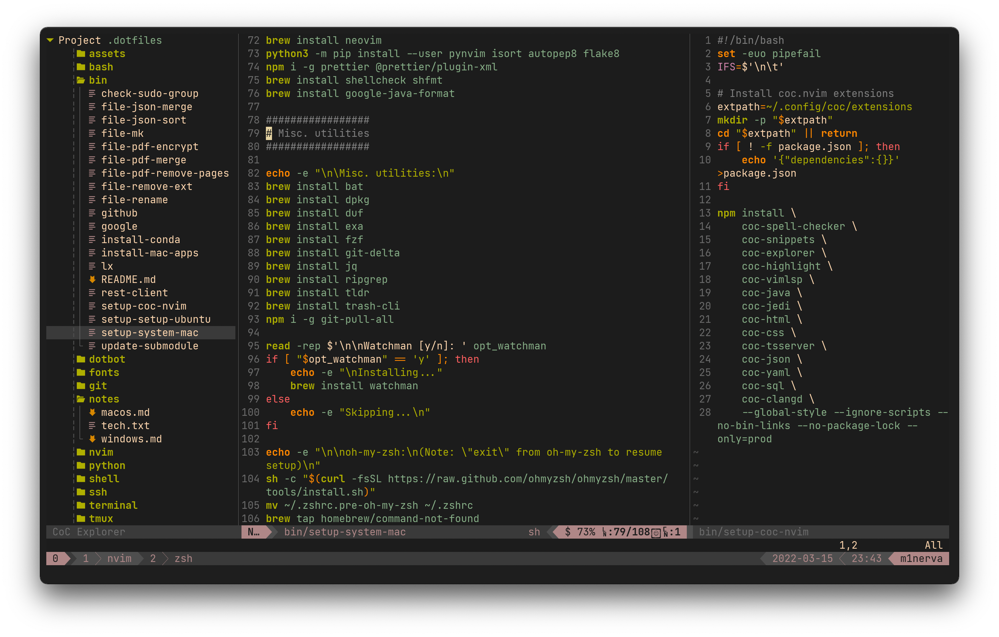
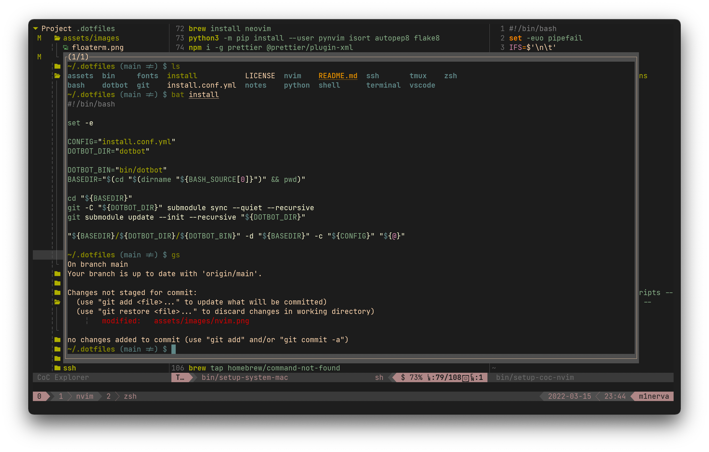

# Dotfiles

Set up a new system, and maintain current configurations. Symlinking to `$HOME` is managed by [Dotbot][dotbot].

```bash
git config --global user.name "Rajit Banerjee"
git config --global user.email "rajit.banerjee@ucdconnect.ie"
git clone git@github.com:rajitbanerjee/dotfiles ~/.dotfiles
mv ~/.gitconfig ~/.gitconfig_local
rm -rf ~/.bashrc ~/.zshrc
cd ~/.dotfiles && ./install
exec $SHELL -l
```

```bash
# setup-system-ubuntu, setup-system-al2
setup-system-mac
setup-coc-nvim
nvim

# install-mac-apps
```




## License

[MIT][license]

[dotbot]: https://github.com/anishathalye/dotbot
[license]: LICENSE
