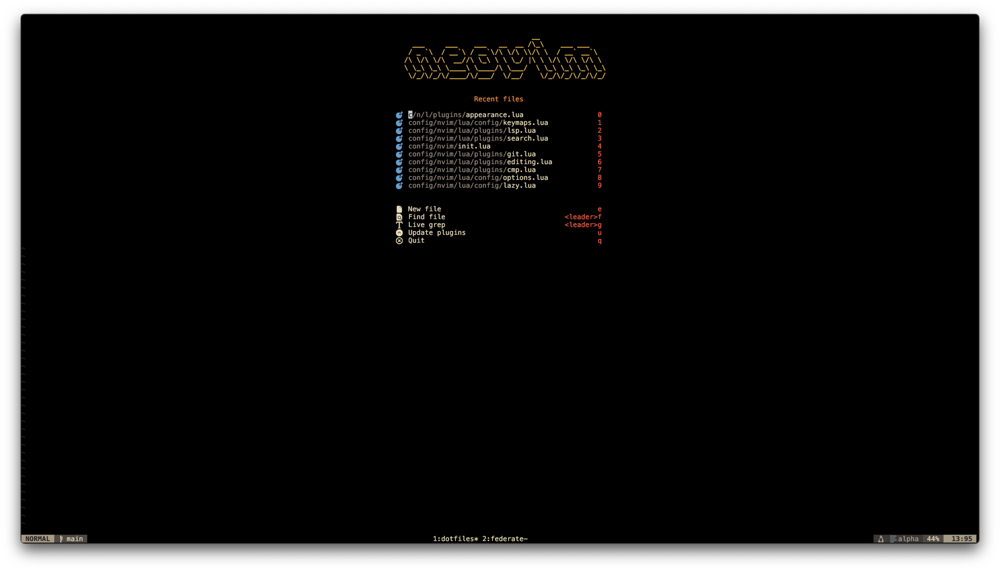
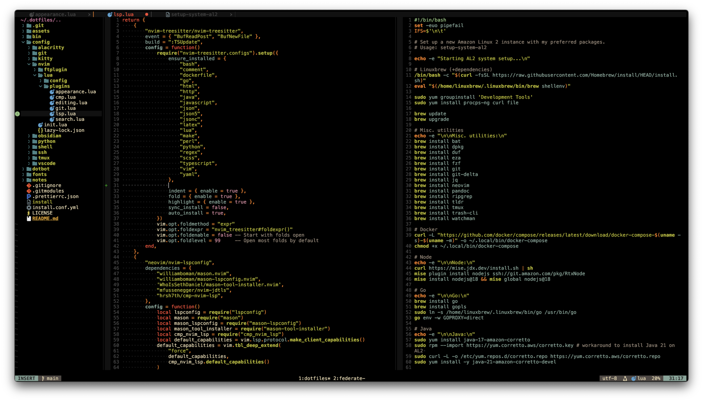
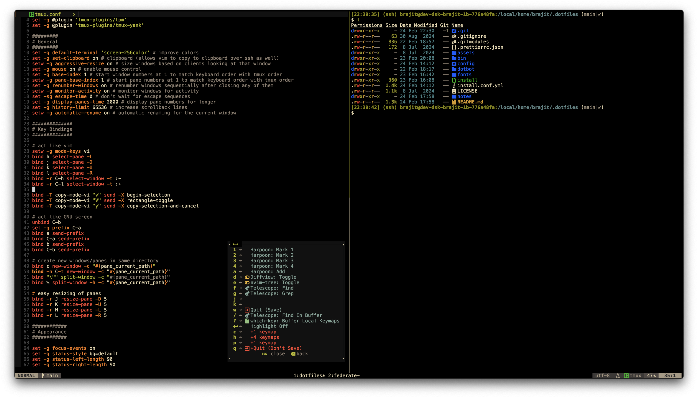

# Dotfiles

System setup and configuration for macOS and Amazon Linux. Symlinking to `$HOME` is managed by [Dotbot][dotbot].

## Setup

### 1. SSH keys

```shell
ssh-keygen -t ed25519 -C "rajitbanerjee15@gmail.com"
eval "$(ssh-agent -s)"
ssh-add ~/.ssh/id_ed25519
cat ~/.ssh/id_ed25519.pub
```

Copy the output and add it at https://github.com/settings/keys.

### 2. Clone and install symlinks

```shell
git config --global user.name "Rajit Banerjee"
git config --global user.email "brajit@amazon.com"
mv ~/.gitconfig ~/.gitconfig_local
git clone git@github.com:rajitbanerjee/dotfiles ~/.dotfiles
cd ~/.dotfiles && ./install
git config user.email "rajitbanerjee15@gmail.com"
exec $SHELL -l
```

### 3. Install system packages

```shell
# Amazon Linux
setup-system-al2023  # or setup-system-al2

# macOS
setup-system-mac
install-mac-apps
```

### 4. (Optional) Migrate zsh history

From your Mac, copy `.zsh_history` between Cloud Desktops:

```shell
scp brajit@<old-host>:~/.zsh_history ~/Desktop/ZSH_HISTORY
scp ~/Desktop/ZSH_HISTORY brajit@<new-host>:~/.zsh_history
```

## Screenshots





## License

[MIT][license]

[dotbot]: https://github.com/anishathalye/dotbot
[license]: LICENSE
