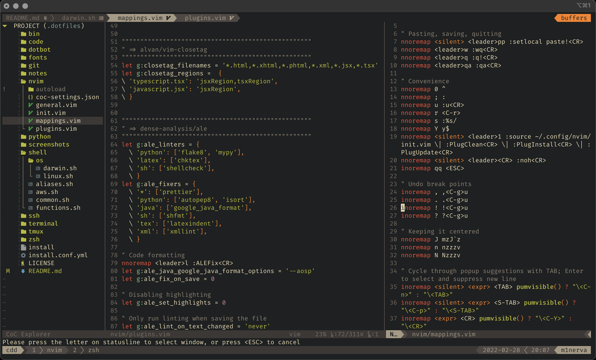

# Dotfiles \[[![Build Status][travis-badge]][travis]]

Always a WIP!

- Shell
  - [zsh/](./zsh/): zsh configurations; plugins managed by [ohmyzsh][ohmyzsh]
  - [shell/](./shell/): common configurations for all types of shells
  - [ssh/](./ssh/): ssh config
  - [terminal/](./terminal/): terminal emulator settings
  - [tmux/](./tmux/): tmux configurations; `tmux.conf` adapted from [anishathalye/dotfiles/tmux.conf][anish]
  - [git/](./git/): git configurations
- Editor
  - [nvim/](./nvim/): neovim configurations
  - [code/](./code/): list of vscode extensions and link to vscode settings sync gist
  - [fonts/](./fonts/): preferred font files
- Misc.
  - [install.conf.yml](./install.conf.yml), [./install](./install): config and installation for dotbot
  - [bin/](./bin/): python/bash scripts
  - [python/](./python/): conda base environment packages and jupyter notebook configurations
  - [notes/](./notes/): misc. programming/tools setup notes

## Installation

Symlinking to `$HOME` is managed by the excellent [Dotbot][dotbot]. Useful in setting up a new system, or maintaining current dotfiles with version control.

```zsh
git clone --recurse-submodules git@github.com:rajitbanerjee/dotfiles ~/.dotfiles
cd ~/.dotfiles && ./install
```

3.  Install a range of packages. See [system-setup-mac][ssm], [system-setup-ubuntu][ssl] and [setup-coc-nvim][scn].

    - macOS or Ubuntu (Linux/WSL2):

    ```zsh
    ./bin/system-setup-mac
    ./bin/system-setup-ubuntu
    ```

    - Set up Neovim and trigger vim-plug installations:

    ```zsh
    nvim
    npm cache verify
    ./bin/setup-coc-nvim
    ```

Neovim:

<p align='center'>
  
  
</p>

The following resources are not directly used/symlinked:

- `code/`: Manually provide gist link to VS Code Settings Sync, and install whatever extensions are necessary.
- `fonts/`: New fonts should be added to the system by the user.
- `notes/`: No tools/scripts, just notes.
- `python/{base.yml,pip*.txt}`: Perform `conda` or `pip` install when required.
- `terminal/`: These settings can be used in the terminal app.

## License

[MIT][license]

[travis-badge]: https://api.travis-ci.com/rajitbanerjee/dotfiles.svg?branch=main
[travis]: https://travis-ci.com/rajitbanerjee/dotfiles
[anish]: https://github.com/anishathalye/dotfiles/blob/master/tmux.conf
[dotbot]: https://github.com/anishathalye/dotbot
[ohmyzsh]: https://github.com/ohmyzsh/ohmyzsh
[ssm]: https://github.com/rajitbanerjee/dotfiles/blob/main/bin/system-setup-mac
[ssl]: https://github.com/rajitbanerjee/dotfiles/blob/main/bin/system-setup-ubuntu
[scn]: https://github.com/rajitbanerjee/dotfiles/blob/main/bin/setup-coc-nvim
[license]: LICENSE
