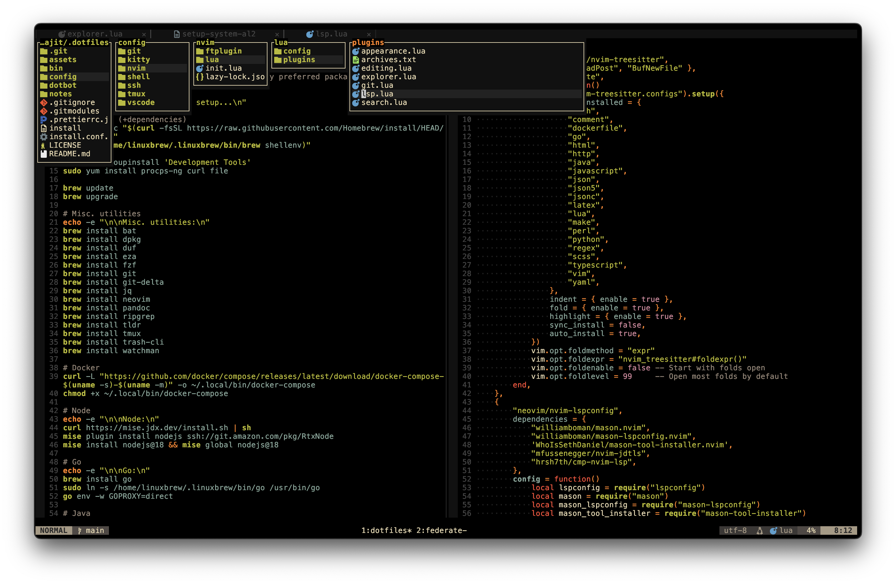

# Dotfiles

Set up a new system, and maintain current configurations. Symlinking to `$HOME` is managed by [Dotbot][dotbot].

```shell
git config --global user.name "Rajit Banerjee"
git config --global user.email "brajit@amazon.com"
git clone git@github.com:rajitbanerjee/dotfiles ~/.dotfiles
mv ~/.gitconfig ~/.gitconfig_local
rm -rf ~/.bashrc ~/.zshrc
cd ~/.dotfiles && ./install
git config user.email "rajitbanerjee15@gmail.com"
exec $SHELL -l
```

```shell
setup-system-al2
# setup-system-mac
nvim
# install-mac-apps
```




### User-Specific Configurations

The following configurations are specific to the user `brajit`, and should be modified if used by others:

- [vscode/settings.json](./config/vscode/settings.json) (`"remote.SSH.configFile": "/Users/brajit/.ssh/config"`)
- [zshrc](./config/shell/zshrc) (`alias wp="cd /workplace/brajit"`)
- [ssh/config](./config/ssh/config) (`Hostname`)

Create a new SSH key for GitHub access:

```shell
ssh-keygen -t ed25519 -C "rajitbanerjee15@gmail.com"
eval "$(ssh-agent -s)"
ssh-add ~/.ssh/id_ed25519
cat ~/.ssh/id_ed25519.pub
```

Paste the public key contents in a new SSH key under https://github.com/settings/keys.

### License

[MIT][license]

[dotbot]: https://github.com/anishathalye/dotbot
[license]: LICENSE
